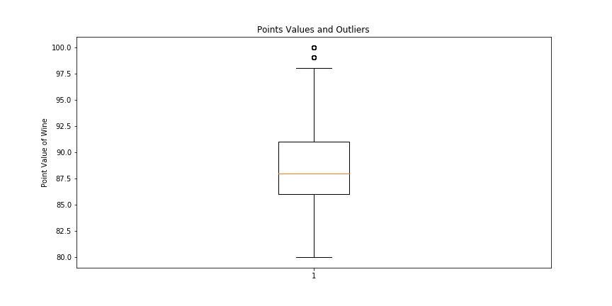
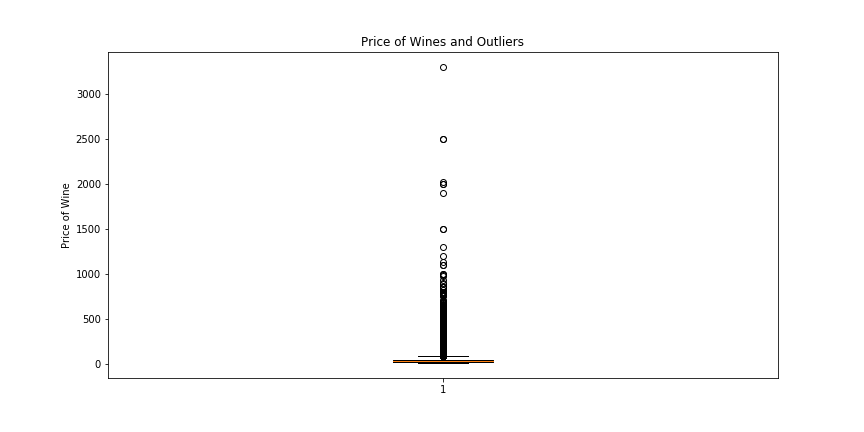
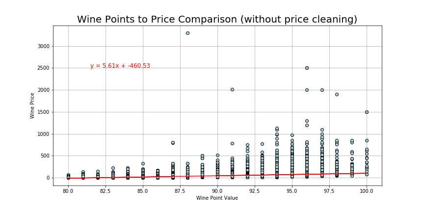
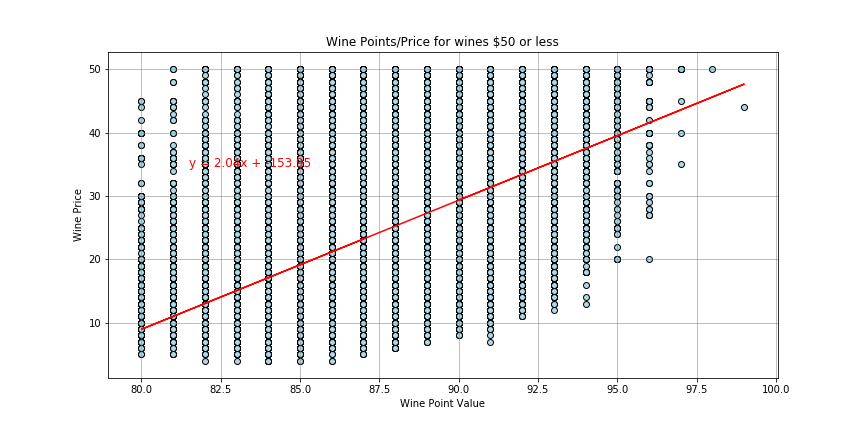
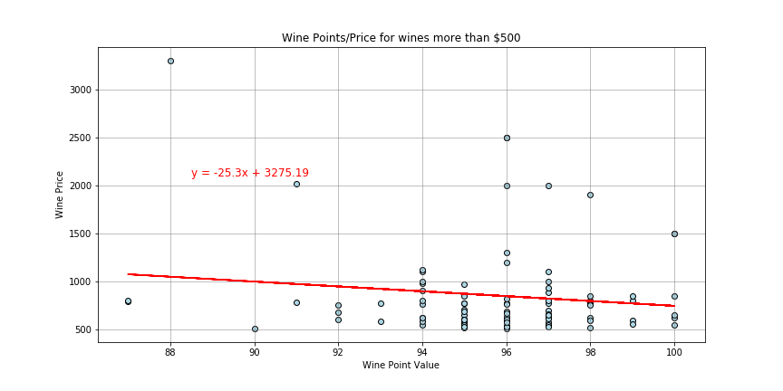
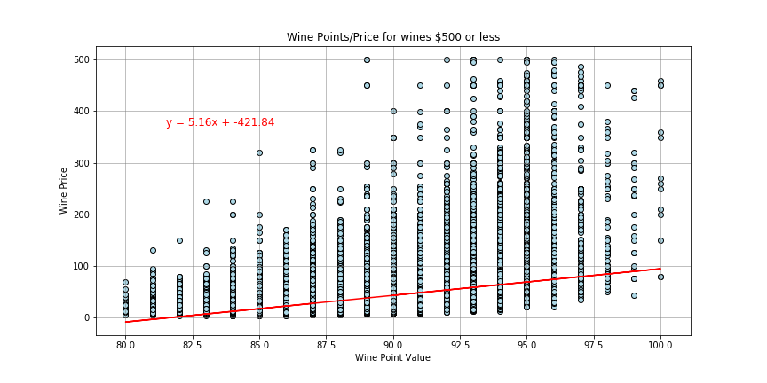

## Price Point Analysis

> #### **120,916 wines** in analysis

> #### **7,241 outliers** in the price of the wine

> #### Most Wines between **$17 and $42** a bottle

> #### There is a small .42 correlation between price and point value of the wines

> #### Analyzed based off pricing
* less than **$50**
* less than **$500**
* more than **$500**

> #### There is a stronger correlation between price and point value for cheaper wines

> #### Expensive (>$500 bottle) have a negative correlation

> #### Findings: You will find plenty of high quality wines on a budget, no need to go expensive.

