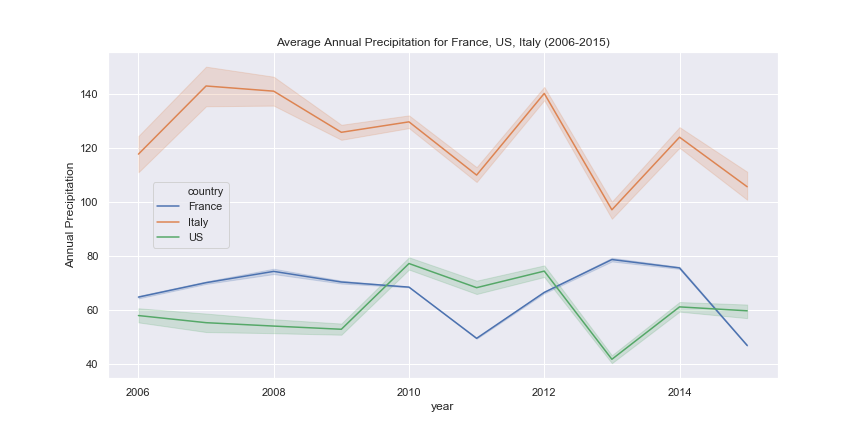

#### TEAM ***CCASS***  

 

##### Chris Brownlee, Chen Ho Ahn, Angela Huynh, Samantha Cassidy, Skip Hobba

 

#### Datasets
* https://www.kaggle.com/zynicide/wine-reviews
* Google Places
* Meteostat API

#### Summary 
* Evaluate the quality of wines based off score/points given by testers to determine if the tester, region, price, or climate impacted the wine’s score or description provided by the tester

#### Questions
* TBD
* TBD

#### Process
* Compare the length of the description to the point value
* Analyze each tester to determine if they have preferred type, region of wine and if that impacts points
* Map average wine score for each province using color to indicate point value
* Using a 10 year period compare score to temperature and precipitation
* Using wines price, plot wine and determine correlation and best wines for budget

#### Wine points scale
* 95-100 Classic: a great wine.
* 90-94 Outstanding: a wine of superior character and style.
* 85-89 Very good: a wine with special qualities.
* 80-84 Good: a solid, well-made wine.
* 75-79 Mediocre: a drinkable wine that may have minor flaws.
* 50-74 Not recommended.

--------
 
 

### 1. Wine description and points analysis.

Jupyter Notebook Link for **Description and Points Analyis** is [Description & Points Analysis](https://nbviewer.jupyter.org/github/halotx3/ccass-wine-ds/blob/ca-baseline/wine-ca.ipynb "Jupyter notebook").

> ##### Picked unique descriptions. 17 uniques points distribution.

> ##### Trie to find correlation between length of description and points
* Not enough datasets at higher points. Not linear at higher points?

> ##### Linear regression 
* Confirmed it is nonlinear at higher points

> ##### Rearrange data into 5 different bins, i.e. 17 diff points --> 5 diff points
* Score 1 : 689
* Score 2 : 3084
* Score 3 : 7154
* Score 4 : 5203
* Score 5 : 3888

> ##### Using binned dataset, we can see linearity between description length and points.

> ##### Can we predict "Score" bin using descriptions?  

* Lengh of description is clearly related with points. 
* But, what if the description is just random words with no meaning?
* The words or context within description should be another critical factor.

> ##### Prediction of points using description (words in the descriptions)

  1. TfidfVectorizer - Transforms text to feature vectors
  2. Random Forest - A classification algorithm. 
  * X: input data [bag of words, i.e. description], 
  * y: classification [1,2,3,4,5]

> ##### Short demo 
* [Demo:](https://musing-hugle-674b40.netlify.app) https://musing-hugle-674b40.netlify.app
* [Github:](https://github.com/moz5691/wine_analysis_flask_react) https://github.com/moz5691/wine_analysis_flask_react

> ##### Findings  

* We can correlate the length of descriptions with points by tasters. 
* We found its linearity between length of descriptions and points after binning datasets.
* Using TFIDF and RandomForestClassifier to predict points using 'description' as a bag of words. Accuracy of prediction (0.98) was pretty satisfactory. 
* It might be interesting to see how the same descriptions are scored as points by the tasters (future work?)
 

 

----------
### 2. Wine tasters' points bias analysis.

Jupyter Notebook Link for **Tasters' points bias analysis** is [Price Point Analysis](https://nbviewer.jupyter.org/github/halotx3/ccass-wine-ds/blob/master/winebased/Wine-Bias.ipynb "Jupyter notebook").

> ##### Reviewers Per Country

* The US has the most wines reviewed, even more than France and Italy combined
* Only 9 countries have more than 1000 wines reviewed

 

> ##### Amount of Reviews per Taster

* There are 14 reviewer who had more than 1000 reviews
 
 

> ##### Wine Scores from Reviewers

* In terms of scoring there appears to be no bias found in the scoring of wines
* Roger Voss was the leader in the number of wines reviewed
* A score of 80 was the lowest score given

 

 
> ##### Average Score Per Wine Taster

* The region of the wine's origin does not have an impact on the score of it
* With the averages of the reviews having parity between the tasters, we can conclude that the reviewers take in no bias when reviewing.

 
---------

--------
### 3. Wine quality with respect to area/region anlaysis

Jupyter Notebook Link for **Quality with respect to area/region analysis** is [Area/Region Analysis](https://nbviewer.jupyter.org/github/halotx3/ccass-wine-ds/blob/master/geocode_slc/Wine_Geocode.ipynb "Jupyter notebook").

##### Average wine points highlighted within regions consist of the below scale
* **90-94** Outstanding: a wine of superior character and style. - RED
* **85-89** Very good: a wine with special qualities. - GREEN
* **80-84** Good: a solid, well-made wine. - BLUE

> ##### [Wine Points Global](https://slcassidy.github.io/ccass_graphs//slc_WinePoints_tricolor.html "gmap")

> ##### [Wine Points Europe](https://slcassidy.github.io/ccass_graphs//slc_WinePoints_Europe.html "gmap")

> ##### [Wine Points Australia and New Zealand](https://slcassidy.github.io/ccass_graphs//slc_WinePoints_Australia_NZ.html "gmap")

> ##### [Wine Points South Africa](https://slcassidy.github.io/ccass_graphs//slc_WinePoints_SAfrical.html "gmap")

> ##### [Wine Points South America](https://slcassidy.github.io/ccass_graphs//slc_WinePoints_SAmerica.html "gmap")

> ##### [Wine Points United States](https://slcassidy.github.io/ccass_graphs//slc_WinePoints_USA.html "gmap")

 

> #### Findings 

* ***Limitations:*** Our data set did not contain points lower than 84 or higher than 94
* Largest wine producing area is in Europe as there are a variety of wine makers
* The areas appearing in green show an average of consistent good wine
* Wine is not necessarily good based on the region, but based on the wine makers
  - Do not see clusters of outstanding wine within a region (red) 
  - Less wine in a location with high point score with no other wineries, example Arkansas wine (red).

 
-----------

------------
### 4. Climate impact to wine quality analysis

Jupyter Notebook Link for **Climate impact analysis** is [Climate Analysis](https://nbviewer.jupyter.org/github/halotx3/ccass-wine-ds/blob/master/APH/WinoAPH_Climate.ipynb "Jupyter notebook").

> ##### Average Annual Temperature for France, US, Italy (2006-2015)

* For the top 3 wine producing countries, the average temperature trend of the 3 countries over the 10 year period do NOT overlap.
* Note that the temperature trend for Italy fluctuates the most year over year.

> ##### Average Annual Precipitation for France, US, Italy (2006-2015)

* Like its temperature trend, the precipitation trend for Italy fluctuates the most year over year.
* Note there's a converse relationship between the precipation trend of US and France over the 10 year period.

> ##### Points vs. Annual Temperature (2006-2015)

* There's a steep negative correlation between points vs. annual average temperature in Italy. The lower the temperature, the higher the points. Note: Tuscany, Piedmont, Veneto were 3 top wine producing regions in Italy.
* There's a slight negative correlation between points vs. annual average temperature for both US and France. Thus per this data set, temperature has little to no affect on quality of wine produced in the regions selected in both US and France between 2006 and 2015.

> ##### Points vs. Annual Precipitation (2006-2015)

* There's a significant positive correlation between points vs. annual average precipitation in both Italy and US. The higher the precipitation, the higher the points.
* There's a slight negative correlation between points vs. annual average precipitation for France. Per this data set, neither temperature nor precipitation has little to no affect on quality of wine produced in the regions of France.

> ##### Interesting to note that we only saw a strong correlation between climate effects on wine quality in Italy, and not US and France.

-------
 

### 5. Price Point Analysis

Jupyter Notebook Link for **Price Point Analyis** is [Price Point Analysis](https://nbviewer.jupyter.org/github/halotx3/ccass-wine-ds/blob/master/Wine%20-%20By%20the%20Numbers%20-%20Price_Point.ipynb "Jupyter notebook").

> ##### **120,916 wines** in analysis

> ##### **7,241 outliers** in the price of the wine

> ##### Most Wines between **$17 and $42** a bottle

> ##### There is a small .42 correlation between price and point value of the wines

> ##### Analyzed based off pricing
* less than **$50**
* less than **$500**
* more than **$500**

> ##### Expensive (>$500 bottle) have a negative correlation

> ##### There is a stronger correlation between price and point value for cheaper wines

> ##### Findings: You will find plenty of high quality wines on a budget, no need to go expensive.
