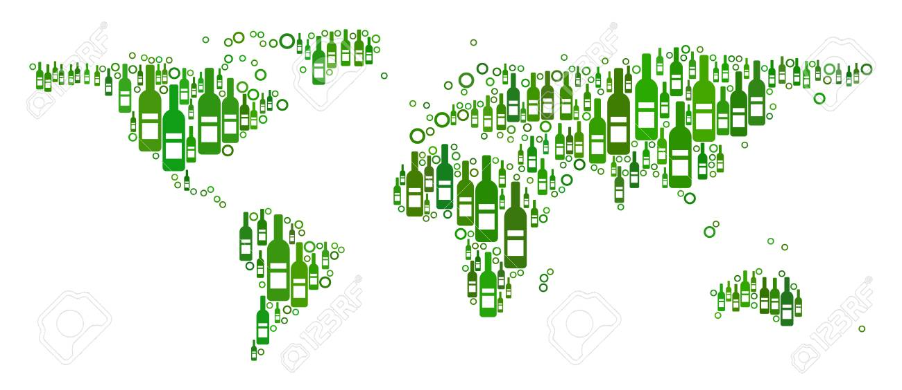

### 1. Price Point Analysis

Jupyter Notebook Link for **Price Point Analyis** is [Price Point Analysis](https://nbviewer.jupyter.org/github/halotx3/ccass-wine-ds/blob/master/Wine%20-%20By%20the%20Numbers%20-%20Price_Point.ipynb "Jupyter notebook").

> ##### **120,916 wines** in analysis

> ##### **7,241 outliers** in the price of the wine

> ##### Most Wines between **$17 and $42** a bottle

> ##### There is a small .42 correlation between price and point value of the wines

> ##### Analyzed based off pricing
* less than **$50**
* less than **$500**
* more than **$500**

> ##### There is a stronger correlation between price and point value for cheaper wines

> ##### Expensive (>$500 bottle) have a negative correlation

> ##### Findings: You will find plenty of high quality wines on a budget, no need to go expensive.

-----------

### 2. Wine tasters' points bias analysis 

> TBD

> TBD

------------

### 3. Wine quality with respect to area/region anlaysis 

> [Wine Points Tricolor](https://slcassidy.github.io/ccass_graphs//slc_WinePoints_tricolor.html "gmap")

> [Wine Points Australia and New Zealand](https://slcassidy.github.io/ccass_graphs//slc_WinePoints_Australia_NZ.html "gmap").

> [Wine Points South Africa](https://slcassidy.github.io/ccass_graphs//slc_WinePoints_SAfrical.html "gmap")

> [Wine Points South America](https://slcassidy.github.io/ccass_graphs//slc_WinePoints_SAmerica.html "gmap")

> [Wine Points United States](https://slcassidy.github.io/ccass_graphs//slc_WinePoints_USA.html "gmap")

-----------

### 4. Climate impact to wine quality analysis

> TBD

> TBD

-------

### 5. Wine description and points analysis.

Jupyter Notebook Link for **Description and Points Analyis** is [Description & Points Analysis](https://nbviewer.jupyter.org/github/halotx3/ccass-wine-ds/blob/ca-baseline/wine-ca.ipynb "Jupyter notebook").

> ##### Picked unique descriptions. 17 uniques points distribution.

> ##### Try to find correlation between length of description and points
* less correlation at higher points

> ##### Linear regression 
* similary it is not linear at higher points

> ##### Rearrange data into 5 different bins, i.e. 17 diff points --> 5 diff points
* Score 1 : 689
* Score 2 : 3084
* Score 3 : 7154
* Score 4 : 5203
* Score 5 : 3888

> ##### It looks a lot more linear with binned dataset.

> ##### Can we predict "Score" bin using descriptions?  

* Lengh of description is clearly related with points. 
* But, what if the description is just random words with no meaning?
* The words or context within description should be another critical factor.

> ##### Prediction of points using description (words in the descriptions)

  1. TfidfVectorizer - Transforms text to feature vectors
  2. Random Forest - A classification algorithm. 
  * X: input data [bag of words, i.e. description], 
  * y: classification [1,2,3,4,5]

> ##### Short demo 
* Demo [LINK](https://musing-hugle-674b40.netlify.app) https://musing-hugle-674b40.netlify.app
* Github [LINK](https://github.com/moz5691/wine_analysis_flask_react) https://github.com/moz5691/wine_analysis_flask_react

> ##### Findings  

* We can correlate the length of descriptions with points by testers. 
* We found its linearity between length of descriptions and points.
* Using TFIDF and RandomForestClassifier to predict points using 'description' as a bag of words. Accuracy of prediction is pretty satisfactory. 
* It might be interesting to see how the same descriptions are scored as points by the testers (future work?)